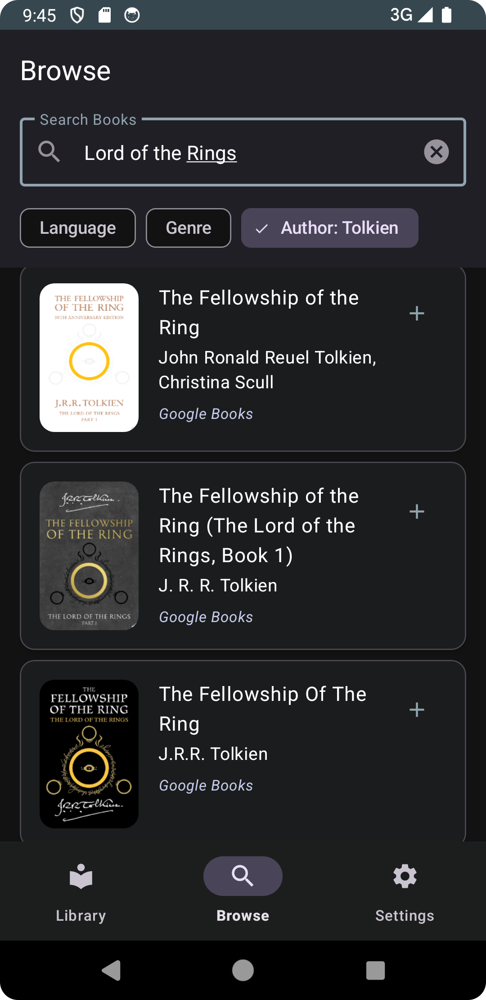
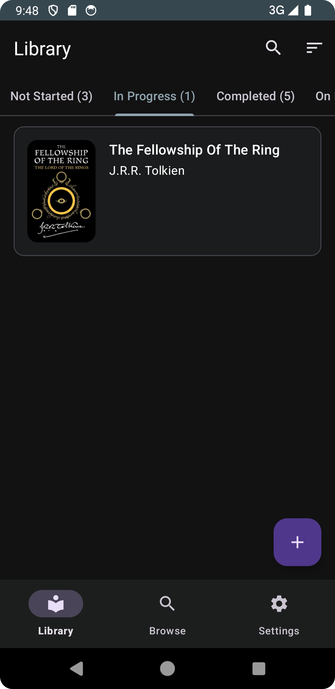
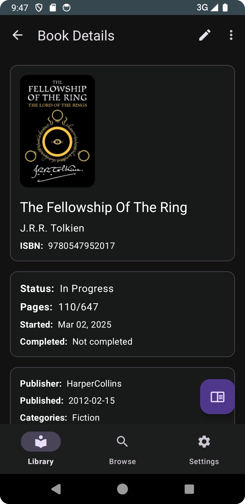

<div align="center">


# Libris

Libris is a Android application to help users manage their personal book
collections.

</div>

## Screenshots
[](assets/browse.png)
[](assets/library.png)
[](assets/details.png)


## Features

### Library Management

- Create and manage your personal book collection
- Track reading progress and status (Not Started, In Progress, Completed, On Hold, Dropped)
- Add custom book covers or use online cover images
- Sort books by title, author, or recent additions
- Search within your library

### Book Discovery

- Search books using Google Books API
- Filter search results by:
    - Language
    - Genre/Category
    - Author
- Add books directly from search results to your library

### Reading Progress

- Track page-by-page reading progress
- Quick progress updates via floating action button
- View completion percentage

### Organization

- Categorize books with multiple genres/categories
- Filter books by reading status
- Add custom metadata including:
    - ISBN
    - Publisher
    - Publication date
    - Language
    - Description

## Usage Examples

### Adding a Book

1. Tap the + FAB in the Library screen
2. Fill in book details manually or
3. Use the Browse function to add a book from Google Books API
4. Add to library

### Updating Reading Progress

1. Open a book's details
2. Tap the book icon FAB
3. Enter current page number or
4. Use quick increment buttons (+10, +25, +50)

### Organizing Books

1. Edit a book's details
2. Add categories using the category chip group
3. Select from categories / genre

## Technical Stack

- Kotlin
- Android Jetpack Components
- Coroutines & Flow
- Material Design 3
- ViewBinding
- MVVM Architecture
- Repository Pattern
- Room Database
- Navigation Component
- ViewModel
- LiveData
- SharedPreferences (used in ThemeManager for theme persistence)
- Fragment-based UI
- Single Activity Architecture
- RecyclerView with ListAdapter

### Dependencies

- **Dagger Hilt**: Dependency injection
- **Room**: Local database
- **Glide**: Image loading and caching
- **OkHttp**: Network operations with Google Books API
- **Navigation Component**: In-app navigation
- **Material Components**: UI elements
- **Kotlin Serialization**: JSON parsing (Google Books API Resonses)
- **Kotlin Coroutines**: Asynchronous operations
- **AndroidX Preference** (for settings screen)
- **AndroidX Core KTX** (for Kotlin extensions)
- **AndroidX ConstraintLayout** (for layouts)
- **KSP** (Kotlin Symbol Processing - used for annotation processing)

## Project Structure

```
app/
├── data/                 # Data layer
│   ├── api/             # API services and models
│   ├── dao/             # Database Access Objects
│   ├── db/              # Room database setup
│   ├── model/           # Data models
│   ├── repository/      # Repository implementations
│   └── storage/         # Local storage utilities
├── di/                  # Dependency injection
├── ui/                  # UI layer
│   ├── components/      # Reusable UI components
│   ├── library/         # Library management
│   ├── search/          # Book search
│   └── settings/        # App settings
└── util/                # Utility classes
```
## Building and Running

1. Clone the repository
2. Open in Android Studio
3. Build and run on the emulator or compatible Android device
